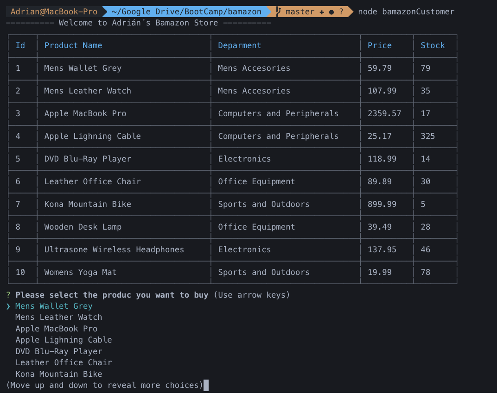
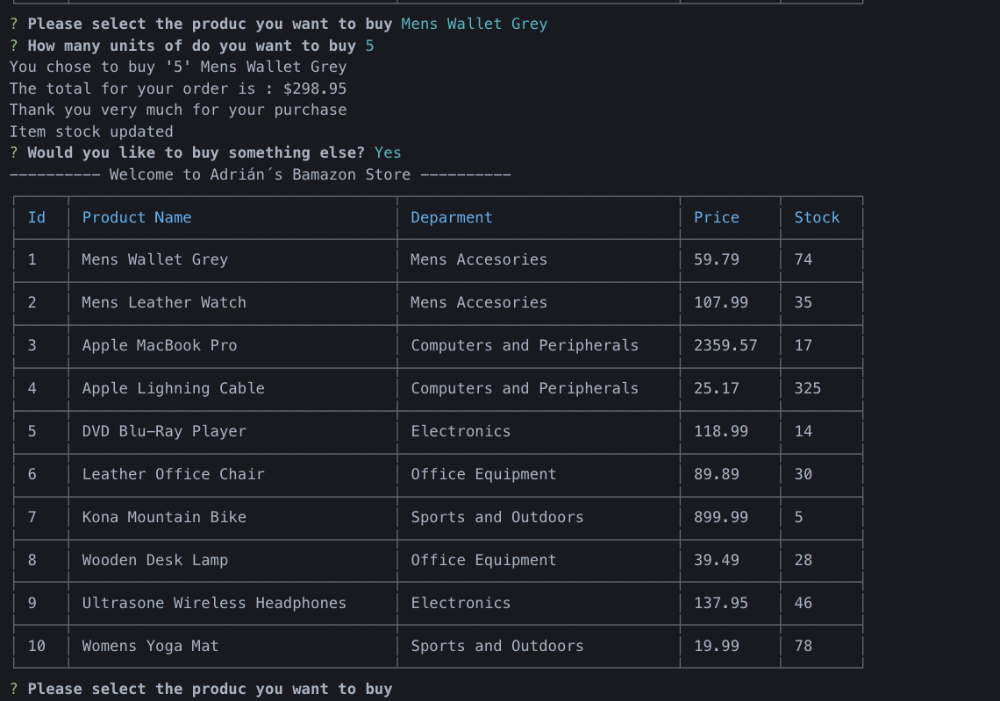
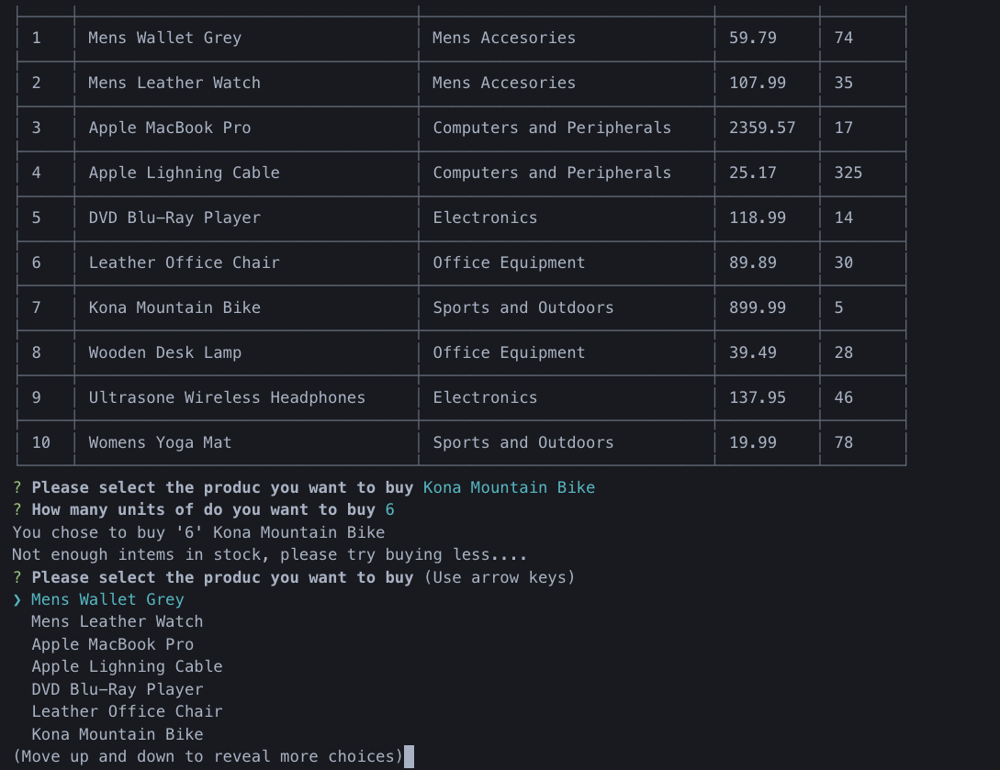

# Adrian's Bamazon

### Node CLI Shop

# Description

Node app with database support to search for products in an Amazon clone.

# Instructions

- The app prompts the user to choose a product to buy.
  
- The second message asks for the amount of units they wish to purchase.
  
- The third images shows what happens if the user wishes tu buy more items than what is in stock.
  

# For your use:

1. Clone my repo and install node packages.

2. Run schema.sql and seeds.sql in an SQL Workbench.

3. Start MAMP server or equivalent.

4. Run in node the app.
